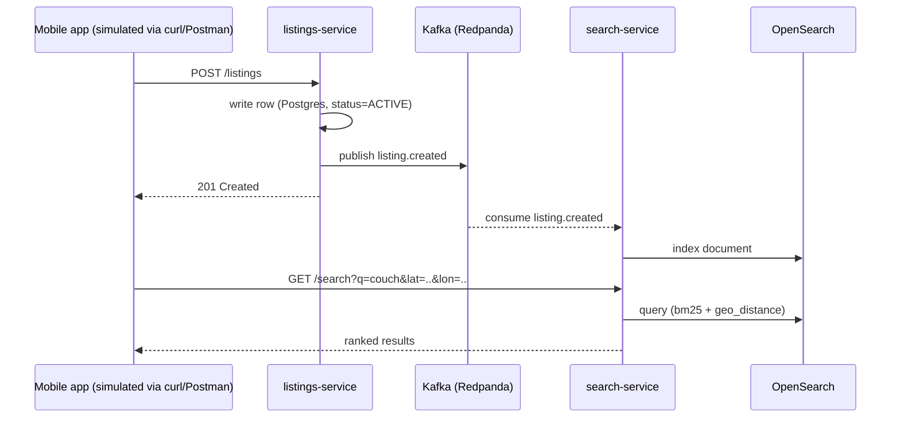
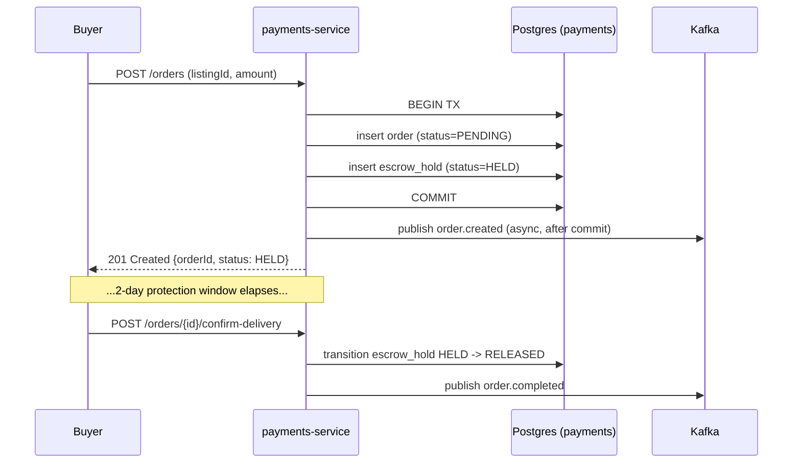

# TDD: C2C Marketplace (mock/simulated, local k8s)

Status: draft, learning project
Author: Terence
Scope: a runnable, simplified simulation of a mid-scale mobile-first C2C marketplace, deployable to a local kind cluster, standing in as a study proxy for how a platform like OfferUp is likely put together.

## 0. A note on grounding

OfferUp doesn't publish a detailed public engineering blog the way Netflix or Uber do, so the *internal infra* choices below (Kafka topic layout, exact service boundaries, database engines) are **my design, not confirmed OfferUp internals** — they're reasonable choices for the constraints, not a reverse-engineered blueprint. What *is* grounded in OfferUp's actual public-facing product (per their help center and trust & safety pages) is the product surface this system simulates:

- **TruYou** — phone number verification + government ID + selfie liveness check via a third-party identity vendor (OfferUp uses Onfido), resulting in a badge on the public profile.
- **In-app messaging** that keeps phone numbers private between buyer and seller.
- **Community MeetUp Spots** — designated safe locations (police stations, retail parking lots) for local exchanges.
- **Nationwide Shipping** — prepaid label generation by weight tier, seller pays a 12.9% service fee (min $1.99) on shipped sales, local cash sales are fee-free.
- **2-Day Buyer Protection** — payment is held (escrow-style) and only released to the seller after a window post-delivery, chargeable back if the buyer disputes.
- **Promote / Bumps / Promote Plus** — paid listing visibility boosts (single boost, competitive bump, or monthly subscription).
- **ML-driven trust & safety** — proactive fraud/counterfeit detection reducing exposure, per their trust & safety commitments.

This mock system implements simplified versions of: listings, search, messaging, escrow payments, and a stub trust & safety hook — enough to see how the pieces talk to each other, not a production clone.

## 1. What's real vs. mocked in this build

| Piece | This build | Real OfferUp equivalent (assumed) |
|---|---|---|
| Identity verification (TruYou) | Stub endpoint that flips a boolean after a fixed delay — no real ID/selfie matching | Third-party ID verification vendor (Onfido per their docs), liveness detection, manual review queue |
| Payments/escrow | State machine over local Postgres rows, no real money movement | PCI-scoped payment processor, real card networks, dispute/chargeback handling |
| Search relevance | OpenSearch with a simple BM25 + geo-distance boost | Likely a similar text+geo approach, possibly ML re-ranking on top |
| Trust & safety | A stub rules check (keyword blocklist) run synchronously on listing create | ML fraud/counterfeit models per their trust & safety page, likely async with human review escalation |
| Shipping | Not implemented (out of scope, flagged in original design) | USPS label integration |
| Push notifications | Not implemented — messaging is WebSocket-only | APNs/FCM |

Being explicit about this matters: the point of the exercise is the *shape* of a real system (service boundaries, consistency choices, event flow), not a feature-complete clone.

## 2. Service breakdown

Four services + shared infra, matching the container diagram from the design review:

- **listings-service** (Ktor, Postgres) — CRUD for listings, publishes `listing.created` / `listing.updated` to Kafka.
- **search-service** (Ktor, OpenSearch, Kafka consumer) — indexes listings async off the event stream, serves search/browse queries directly from OpenSearch.
- **messaging-service** (Ktor, Postgres, Redis, WebSocket) — per-conversation chat, Redis holds the "which pod has this user's socket" presence map so any replica can route a message.
- **payments-service** (Ktor, Postgres) — the one service with a real transactional boundary: charge → escrow hold → release, modeled as an explicit state machine.

`common` is a shared Gradle module with the Kafka event schemas (Kotlin data classes, `kotlinx.serialization`) so producers and consumers can't drift silently.

## 3. Data flow (mirrors the design review, now with real transport)





The escrow state machine is the one place a transaction spans two writes (order + hold) that must commit together — everything else in the system is a single-row write followed by an async event, which is why listings/search can be eventually consistent but payments can't.

## 4. Data model (per service — no shared database)

**listings-service (Postgres)**
```sql
CREATE TABLE listings (
    id UUID PRIMARY KEY,
    seller_id UUID NOT NULL,
    title TEXT NOT NULL,
    description TEXT,
    price_cents INT NOT NULL,
    category TEXT NOT NULL,
    lat DOUBLE PRECISION NOT NULL,
    lon DOUBLE PRECISION NOT NULL,
    status TEXT NOT NULL DEFAULT 'ACTIVE', -- ACTIVE, SOLD, REMOVED
    created_at TIMESTAMPTZ NOT NULL DEFAULT now()
);
```

**messaging-service (Postgres)**
```sql
CREATE TABLE messages (
    id UUID PRIMARY KEY,
    conversation_id UUID NOT NULL,
    sender_id UUID NOT NULL,
    body TEXT NOT NULL,
    sent_at TIMESTAMPTZ NOT NULL DEFAULT now()
);
CREATE INDEX idx_messages_conversation ON messages(conversation_id, sent_at);
```

**payments-service (Postgres)**
```sql
CREATE TABLE orders (
    id UUID PRIMARY KEY,
    listing_id UUID NOT NULL,
    buyer_id UUID NOT NULL,
    seller_id UUID NOT NULL,
    amount_cents INT NOT NULL,
    status TEXT NOT NULL -- PENDING, HELD, RELEASED, REFUNDED
);
CREATE TABLE escrow_holds (
    order_id UUID PRIMARY KEY REFERENCES orders(id),
    status TEXT NOT NULL, -- HELD, RELEASED, REFUNDED
    held_at TIMESTAMPTZ NOT NULL DEFAULT now(),
    released_at TIMESTAMPTZ
);
```

**search-service** has no primary datastore of its own — OpenSearch is the store, populated entirely from Kafka. If you deleted the OpenSearch index right now, replaying the Kafka topic from offset 0 would fully rebuild it. That replayability is the whole point of driving it from events instead of a direct write.

## 5. Kafka topics

| Topic | Producer | Consumer(s) | Key |
|---|---|---|---|
| `listing.created` | listings-service | search-service | `listingId` |
| `listing.updated` | listings-service | search-service | `listingId` |
| `order.created` | payments-service | (none yet — hook point for notifications) | `orderId` |
| `order.completed` | payments-service | (none yet) | `orderId` |

Keyed by entity ID so all events for one listing/order land on the same partition and are processed in order.

## 6. Repo layout

```
c2c-marketplace-mock/
├── common/                  # shared Kotlin event models (kotlinx.serialization)
├── listings-service/
├── search-service/
├── messaging-service/
├── payments-service/
├── infra/
│   ├── docker-compose.yml   # fastest inner loop: run infra + services locally, no k8s
│   └── k8s/                 # kind manifests: namespace, infra, then the 4 services
└── scripts/
    ├── build-images.sh      # gradle build + docker build for all 4 services
    └── deploy-kind.sh        # create kind cluster, load images, kubectl apply
```

## 7. Running it

**Fast inner loop (docker-compose, no k8s):**
```bash
cd infra
docker compose up -d          # postgres, redis, opensearch, redpanda
cd ..
./gradlew :listings-service:run &
./gradlew :search-service:run &
./gradlew :messaging-service:run &
./gradlew :payments-service:run &
```

**Full local k8s (kind):**
```bash
./scripts/build-images.sh     # gradle build + docker build, tags images c2c/<service>:local
./scripts/deploy-kind.sh      # kind create cluster, kind load docker-image, kubectl apply -f infra/k8s
kubectl -n c2c get pods -w
```

Ports are forwarded per-service in the k8s manifests (`kubectl port-forward`) — see README for the exact commands.

## 8. Testing strategy

- **Unit tests**: the escrow state machine (`payments-service`) is pure logic (given current status + event, what's the next status) — no I/O, fast, exhaustive over all (state, event) pairs including illegal transitions.
- **Integration tests**: listings-service uses Testcontainers to spin up a real Postgres for repository tests rather than mocking the DB driver — the SQL itself is what you want confidence in, not that Kotlin can call a mock correctly.
- **What's intentionally not tested here**: cross-service flows (create listing → appears in search) would need either a docker-compose-based test harness or contract tests against the Kafka schema — noted as a next step, not built, to keep the scaffold's build time reasonable.

## 9. Known simplifications / what I'd fix before this was real

- No auth/authz at all — every endpoint trusts a `userId` passed in the request body. A real system puts identity behind the API gateway (JWT validation) before requests reach any service.
- No API gateway in this build — services are called directly on their own ports. The container diagram's gateway/BFF layer is elided here to keep the scaffold's moving parts manageable; routing/auth/rate-limiting would live there.
- Single replica per service in the k8s manifests — the interesting failure modes (rebalancing, leader election, split-brain on the messaging presence map) only show up with 2+ replicas, which is a good next experiment once the base system is running.
- No observability stack (metrics/tracing) wired up — logs only, to stdout, for `kubectl logs`.
