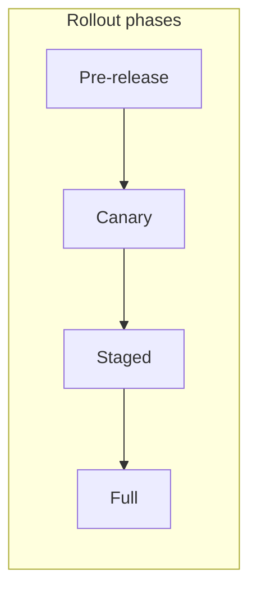

# Telemetry-Driven Rollout Playbook

This playbook describes how to roll out a new feature or service version using **telemetry-driven phases**: pre-release, canary, and staged rollout. Use it when deploying API or worker changes (e.g. GraphQL, new backends) so that metrics and traces guide go/no-go decisions.

---

## Phases overview

| Phase | Goal | Typical traffic |
|-------|------|------------------|
| **Pre-release** | Validate in non-production (staging, shadow). | 0% production. |
| **Canary** | One or a few instances get real traffic; compare metrics to baseline. | 1–5% production. |
| **Staged** | Increase percentage in steps (e.g. 5% → 25% → 50%). | 5% → 50%. |
| **Full** | 100% on new version; old version retired. | 100%. |

---

## Before you start

- [ ] **Metrics defined:** Error rate, latency (p50/p95/p99), throughput (RPS or queue depth). Know how they are scraped or exported (e.g. Prometheus, Datadog, OTLP).
- [ ] **Baseline captured:** Record baseline for the metrics above on the current version (e.g. 24h before rollout).
- [ ] **Rollback procedure:** Document how to route traffic back to the old version or scale down the new one. Rehearse if possible.
- [ ] **Owners and comms:** Who decides go/no-go at each phase; where updates are posted (Slack, status page, incident channel).

---

## Phase 1: Pre-release

- Deploy the new version in **staging** or as a **shadow** (receives copy of traffic but does not serve responses).
- Run smoke and integration tests; confirm logs and traces look correct.
- **Go/no-go:** No critical errors, traces and metrics flowing. Proceed to canary only if pre-release is stable.

---

## Phase 2: Canary

- Route a **small percentage** of production traffic to the new version (e.g. 1–5% via load balancer weights or feature flags).
- **Watch:** Error rate, latency percentiles, and any custom metrics (e.g. queue depth, cache hit rate). Compare to baseline.
- **Duration:** At least 15–30 minutes; extend if traffic is low or metrics are noisy.
- **Go:** If error rate and latency are within tolerance (e.g. no increase > 10% in p99, error rate within baseline band), proceed to staged.
- **No-go:** If errors spike or latency degrades, **roll back** (route traffic off canary) and investigate. Document findings before retry.

---

## Phase 3: Staged

- Increase traffic in **steps** (e.g. 5% → 25% → 50% → 100%). After each step, wait and observe (e.g. 15–30 min).
- At each step, re-check error rate and latency; roll back if thresholds are exceeded.
- **Document:** Record each step (time, percentage, metrics snapshot) so you can correlate issues with a specific step.

---

## Phase 4: Full

- Route 100% traffic to the new version. Retire or scale down the old version.
- Keep monitoring for at least 24–48 hours; have rollback ready in case delayed issues appear.

---

## Rollback

- **When:** Error rate or latency exceeds agreed thresholds, or critical bugs are found.
- **How:** Revert traffic to the previous version (e.g. revert load balancer config, feature flag, or scaling). Document the rollback and root cause.
- **After:** Post-mortem if the rollback was due to an incident; update this playbook if the procedure was wrong or missing.

---

## Checklist (summary)

- [ ] Metrics and baseline defined
- [ ] Rollback procedure documented and known
- [ ] Pre-release passed
- [ ] Canary: traffic %, duration, metrics within tolerance
- [ ] Staged: each step observed; no regression
- [ ] Full: 100% cutover; old version retired
- [ ] Rollback executed if needed; post-mortem if applicable
