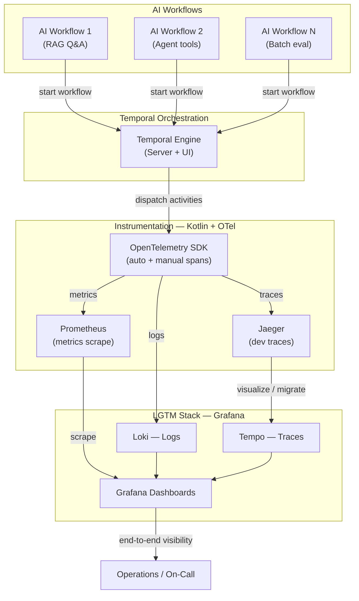

# System Design: Temporal-Orchestrated Observability Platform

**Version:** 1.0  
**Status:** Proposed (greenfield)  
**Last updated:** 2026-05-19

## Executive summary

This platform demonstrates how **durable AI workflows** orchestrated by **Temporal** can be **instrumented once** (Kotlin worker + OpenTelemetry) and **observed end-to-end** through metrics, traces, and logs unified in **Grafana**. The reference implementation is portfolio-scoped: one Temporal namespace, three sample AI workflows, local Docker Compose, and operator dashboards—not multi-tenant SaaS.

## Requirements

### Functional

| ID | Requirement |
|----|-------------|
| F-01 | Run **N sample AI workflows** (LLM call, retrieval, tool-use patterns) as Temporal workflows with retriable activities |
| F-02 | **Temporal Engine** schedules activities, records workflow history, and surfaces failures with deterministic replay |
| F-03 | **Kotlin workers** execute activities and emit **OTel traces + metrics** for workflow run, activity, and outbound HTTP/LLM calls |
| F-04 | **Traces** land in a trace backend (Jaeger for dev; Tempo for LGTM path) with **workflow_id** / **run_id** / **activity** attributes |
| F-05 | **Metrics** expose RED-style counters/histograms (requests, latency, errors) scraped by Prometheus |
| F-06 | **Logs** (structured JSON) correlate to trace_id and workflow identifiers, shipped to Loki |
| F-07 | **Grafana dashboards** visualize workflow health, activity latency, LLM token/latency proxies, and infra signals |
| F-08 | **Operations runbook** documents alert response for stuck workflows, trace gaps, and collector failures |

### Non-functional

| Category | Target |
|----------|--------|
| **Performance** | Activity p95 &lt; 30s for sample LLM stub; OTel export batch &lt; 5s delay |
| **Availability** | 99% local/demo (single-node Compose); document HA path for Temporal + LGTM |
| **Scalability** | 10 concurrent workflow runs on laptop; horizontal worker scale documented |
| **Security** | No secrets in repo; API keys via env/Secrets; Temporal mTLS noted for prod |
| **Observability** | 100% of sample workflows have trace root span; metrics cardinality bounded |
| **Maintainability** | One-command Compose up; ADRs for major forks |

### Constraints

- **Kotlin** for workers (JVM 21, Gradle)
- **Temporal** self-hosted (dev server or Docker)
- **OpenTelemetry** Java/Kotlin SDK (no vendor-specific agents required for v1)
- **LGTM** via Grafana stack in Compose (Loki, Tempo, Prometheus/Mimir, Grafana)
- **Portfolio timeline:** 6–8 weeks part-time equivalent across 7 GSD phases

## High-level architecture



## Component details

### 1. AI Workflows (application layer)

Three reference workflows illustrate common AI patterns:

| Workflow | Pattern | Activities |
|----------|---------|------------|
| **WF-1 RAG Q&A** | Retrieve → generate | `embedQuery`, `vectorSearch`, `llmComplete` |
| **WF-2 Agent tools** | Plan → tool loop | `planStep`, `callTool`, `synthesize` |
| **WF-3 Batch eval** | Fan-out | `loadDataset`, `scoreItem` (child), `aggregate` |

Each workflow is a Temporal workflow interface; activities run on Kotlin workers. LLM calls are **stubbed or keyed** (OpenAI-compatible HTTP) so CI does not require live keys.

**Boundaries:** Workflows contain orchestration logic only—no direct HTTP from workflow code (Temporal determinism). All I/O in activities.

### 2. Temporal Orchestration

| Piece | Technology | Responsibility |
|-------|------------|----------------|
| Temporal Server | `temporalio/auto-setup` or dev server | Persistence, task queues, history |
| Temporal UI | Bundled | Inspect runs, failures, retries |
| Workers | Kotlin + Temporal SDK | Poll task queues, execute activities |
| Task queues | `ai-workflows`, `ai-activities` | Separate workflow vs activity scaling (optional v1: single queue) |

**Key identifiers for observability:**

- `WorkflowId`, `RunId`, `ActivityType`, `Attempt` → propagated as OTel resource attributes and log fields
- Interceptors: Temporal SDK **OpenTelemetry interceptors** where available; fallback manual span wrapping

### 3. Instrumentation — Kotlin + OpenTelemetry

```
┌─────────────────────────────────────────────────────────┐
│ Kotlin Worker Process                                    │
│  ┌──────────────┐  ┌──────────────┐  ┌──────────────┐ │
│  │ Temporal     │  │ OTel SDK     │  │ Activity     │ │
│  │ Worker       │──│ Tracer/Meter │──│ implementations│ │
│  └──────────────┘  └──────┬───────┘  └──────────────┘ │
│                           │                             │
│              ┌────────────┼────────────┐                │
│              ▼            ▼            ▼                │
│         OTLP/gRPC   Prometheus    stdout JSON         │
│         (traces)    (/metrics)    (logs → Promtail)   │
└─────────────────────────────────────────────────────────┘
```

| Signal | Instrumentation | Export |
|--------|-----------------|--------|
| **Traces** | Workflow/activity spans, HTTP client spans | OTLP → Jaeger (Phase 5) → Tempo (Phase 6) |
| **Metrics** | `workflow.started`, `activity.duration`, `llm.tokens` (stub counter) | Prometheus scrape endpoint :9464 |
| **Logs** | JSON with `trace_id`, `workflow_id`, `activity_type` | Promtail → Loki |

**Cardinality rules:** Do not label metrics with unbounded `workflow_id`; use `workflow_type`, `activity_type`, `status`.

### 4. LGTM stack — Grafana

| Component | Role | Source |
|-----------|------|--------|
| **Prometheus** | Metrics TSDB | Scrapes worker + Temporal metrics (where exposed) |
| **Jaeger** | Dev trace UI (Phase 5) | OTLP ingest; optional dual-write to Tempo |
| **Tempo** | Trace storage for Grafana | OTLP from collector or Jaeger migration |
| **Loki** | Log aggregation | Promtail ships worker logs |
| **Grafana** | Dashboards + Explore | Datasources: Prometheus, Loki, Tempo |

**Dashboard packs (Phase 6):**

1. **Workflow overview** — starts/completions/failures by `workflow_type`
2. **Activity latency** — heatmap p50/p95 by `activity_type`
3. **LLM proxy** — request rate, error rate, duration (stub or real)
4. **Trace explorer links** — Log → Trace (Loki derived fields)

### 5. Operations / On-Call

| Concern | Detection | Response |
|---------|-----------|----------|
| Stuck workflow | Temporal UI + alert on run duration | Cancel/reset per runbook |
| Missing traces | Metric `otel_export_errors` or span drop rate | Check collector, backoff, sampling |
| High activity failure rate | Prometheus alert | Inspect activity logs, retry policy |
| LGTM disk pressure | Loki/Tempo volume alerts | Retention tune, compaction |

## Data flows

### Happy path: workflow run

1. Client (CLI or HTTP starter) starts `RagQaWorkflow` on Temporal.
2. Temporal records `WorkflowExecutionStarted`; worker picks workflow task.
3. Worker OTel creates root span `workflow RagQaWorkflow` with `workflow_id` attribute.
4. Activity `vectorSearch` runs; child span `activity vectorSearch`; logs include trace context.
5. OTLP exporter sends spans to collector → Jaeger/Tempo; metrics scraped every 15s.
6. Operator opens Grafana → sees spike in `activity.duration` for `vectorSearch`, drills to trace.

### Failure path: activity retry

1. Activity throws (simulated 5xx from LLM stub).
2. Temporal schedules retry per policy; span events mark `exception` and `retry_attempt`.
3. Dashboard shows failed attempts; trace shows multiple activity segments linked by `workflow_id`.

## Technology recommendations

| Layer | Choice | Rationale |
|-------|--------|-----------|
| Orchestration | Temporal 1.25+ | Durable execution, AI-friendly long runs |
| Worker language | Kotlin 2.x / JVM 21 | Strong Temporal SDK, coroutines, portfolio signal |
| Telemetry | OpenTelemetry Java 1.40+ | Vendor-neutral, Grafana-native OTLP |
| Trace dev UI | Jaeger all-in-one | Fast feedback in Phase 5 |
| Trace prod path | Grafana Tempo | Native Grafana correlation |
| Metrics | Prometheus | De facto; simple scrape |
| Logs | Loki + Promtail | Label-based correlation with traces |
| Dashboards | Grafana 11+ | Single pane for LGTM |

## Key decisions (ADR index)

| ADR | Title |
|-----|-------|
| [ADR-001](adr/0001-temporal-for-ai-orchestration.md) | Use Temporal for AI workflow orchestration |
| [ADR-002](adr/0002-kotlin-worker-opentelemetry.md) | Kotlin workers with OpenTelemetry SDK |
| [ADR-003](adr/0003-jaeger-dev-tempo-lgtm.md) | Jaeger for dev traces, Tempo for LGTM |
| [ADR-004](adr/0004-workflow-trace-correlation.md) | Workflow/run ID propagation in telemetry |
| [ADR-005](adr/0005-compose-local-lgtm.md) | Docker Compose for local LGTM stack |

## Failure modes

| Failure | Impact | Mitigation |
|---------|--------|------------|
| Temporal DB unavailable | No new workflows | Postgres persistence; restart policy |
| Worker down | Tasks backlog | HPA/replica docs; alert queue depth |
| OTel collector down | Trace gaps | Buffer + retry; alert export errors |
| Prometheus full | Metrics loss | Retention limits; recording rules |
| LLM provider outage | Activity failures | Temporal retry + circuit breaker in activity |
| Cardinality explosion | Prometheus OOM | Bounded labels; drop high-cardinality attrs |

## Security considerations

- Temporal namespace isolation; default namespace for dev only
- mTLS between worker and Temporal documented for production
- Secrets: `OPENAI_API_KEY`, `TEMPORAL_API_KEY` via env files gitignored
- No PII in logs; sample workflows use synthetic data
- Grafana admin password not default in any committed Compose

## Repository layout (target)

```
temp-orch-obse-plat/
├── worker/                 # Kotlin Temporal worker + OTel
├── workflows/              # Workflow interfaces + shared models
├── starter/                # CLI to start sample workflows
├── deploy/
│   ├── docker-compose.yml  # Temporal + LGTM + Jaeger
│   └── grafana/dashboards/
├── docs/
│   ├── ARCHITECTURE.md
│   ├── OPERATIONS.md
│   └── adr/
├── scripts/
│   └── smoke.sh
└── .planning/              # GSD artifacts
```

## Risks and mitigations

| Risk | Likelihood | Mitigation |
|------|------------|------------|
| Temporal + OTel interceptor gaps in Kotlin | Medium | Manual span wrapper fallback; test span presence |
| Dual trace backends (Jaeger + Tempo) confuse operators | Medium | ADR-003; Phase 6 cutover checklist |
| LLM flakiness breaks CI | High | Stub server in Compose; contract tests |
| LGTM resource use on laptop | Medium | Profile limits in Compose; reduced retention |

## GSD phase mapping

| Phase | Delivers |
|-------|----------|
| 1 | Foundation — repo, Compose skeleton, smoke |
| 2 | Temporal server + worker shell |
| 3 | Three AI sample workflows |
| 4 | Kotlin OTel instrumentation |
| 5 | Prometheus + Jaeger wiring |
| 6 | Loki, Tempo, Grafana dashboards |
| 7 | Operations runbooks + verification |

See [`.planning/ROADMAP.md`](../.planning/ROADMAP.md) for executable plans per phase.
