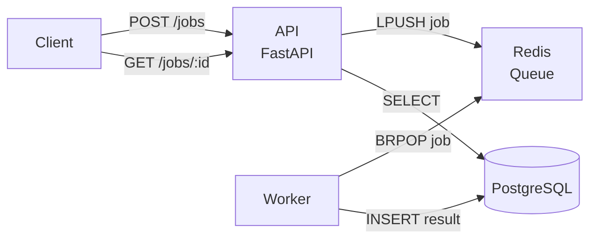

# Workflow API Demo

**Problem:** Show a small distributed pipeline: an API that enqueues work, a worker that processes it, and a datastore for results.

**Solution:** An HTTP API (FastAPI) that submits jobs to a Redis queue; a Python worker consumes the queue, processes each job, and records results in PostgreSQL. Docker Compose runs the full stack.

**What this demonstrates:** Designing and implementing a small event-driven pipeline with clear API design and documentation—aligned with GraphQL/Kafka-style workflows and streamlined pipelines.

---

## Architecture



- **API:** Accepts `POST /jobs` (enqueue) and `GET /jobs/{id}` (status/result). Uses Redis to push job IDs to a list; worker pops and processes.
- **Worker:** Blocks on Redis (BRPOP), loads job payload, "processes" (e.g. sleep + update status), writes result to PostgreSQL.
- **PostgreSQL:** Stores job id, status, result, created_at.

---

## How to run locally

**With Docker Compose:**

```bash
docker compose up --build
```

- API: http://localhost:8000  
- Docs: http://localhost:8000/docs  

**Example:**

```bash
# Create a job
curl -X POST http://localhost:8000/jobs -H "Content-Type: application/json" -d '{"payload": "hello"}'
# Returns {"id": "uuid", "status": "queued"}

# Get job status/result
curl http://localhost:8000/jobs/{id}
```

---

## Rollout / canary (prose)

For production, you would: (1) deploy the new worker version behind a feature flag or canary pool, (2) route a small percentage of traffic to the new worker, (3) watch error rate and latency metrics, (4) roll back if thresholds are exceeded. A **telemetry-driven rollout playbook** (pre-release, canary, staged) is provided in the sibling repo [platform-audit-template](../platform-audit-template/docs/rollout-playbook.md).

---

## License

MIT.
